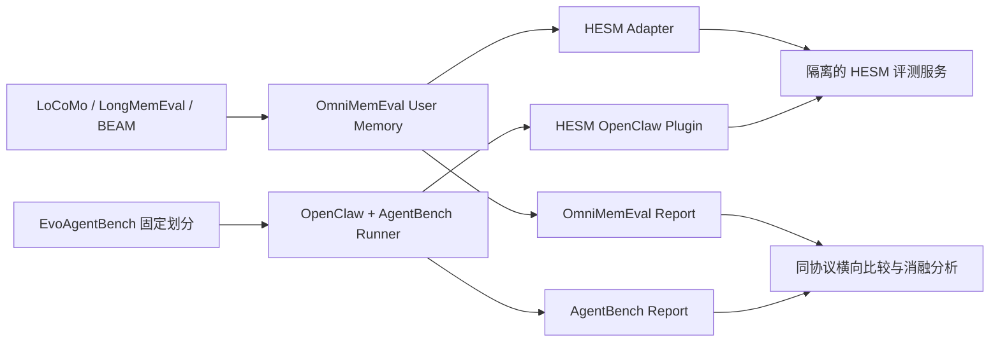

# HESM 长期记忆与 Agent 实验实施方案

版本：v1.1，2026-09-08。目标是检验 Hierarchical、State、Experience 三项设计能否提高准确性、减少回答上下文和降低 Agent 完成任务的成本。所有优势均为待验证假设。当前 LoCoMo、LongMemEval、BEAM 的 User Memory Adapter 与独立评测服务已经实现但未正式运行；OpenClaw / EvoAgentBench 保留为后续范围。具体操作见 [User Memory 实验说明](USER_MEMORY_GUIDE_CN.md)。

## 1. 实验总体设计

采用两条评测线，共用实验版本、原始记录和横向比较规范：



OpenClaw 是 Agent runtime；EvoAgentBench 才是任务数据与任务协议来源。两条评测线都复用 OmniMemEval 已有 runner、回答器和 verifier，不再实现一套不同的评分流水线。

| 研究问题 | 主基准 | 主指标 | 必需对照 | 结论边界 |
|---|---|---|---|---|
| 记忆组织是否提高回答效率 | LoCoMo | Overall Accuracy、Context Tokens | HESM、Flat RAG、三个产品基线 | 在准确率相近时是否减少上下文 |
| State 是否改善更新与跨会话推理 | LongMemEval-S | Knowledge Update、Multi-Session、Temporal Reasoning Accuracy | HESM vs HESM w/o State | 三个切片分别报告，不以 Overall 掩盖退化 |
| Hierarchical 是否适应历史规模增长 | BEAM | 各规模 Nugget Score、Context Tokens | HESM vs Flat RAG / w/o Hierarchical | 固定预算下保持质量；同时量化索引、写入与检索成本 |
| Experience 是否支持经验迁移 | OpenClaw + EvoAgentBench | 各域 Acc、Avg Turns | 无插件、HESM w/o Experience、HESM | 训练经验对未见测试任务是否有效 |

只比较 HESM 与其他产品，无法单独证明内部机制的因果作用。因此主实验和消融必须同时存在。

## 2. 已检查的代码与必须先补齐的能力

检查基线：

- HESM：`43658719bb8cf15b4c73b92ac39f0afba25d55ff`，目录 `D:/code/hesm`。
- OmniMemEval：`0b1ea8d28aa2d3e03ac4a6aee17b3006a131da7d`，目录 `D:/code/OmniMemEval`。
- 本地已有 `data/locomo/locomo10.json`；LongMemEval 和 BEAM 目录在检查时只有准备脚本与说明。文件存在不代表数据校验或实验完成。

| 现状 | 证据位置 | 实施要求 |
|---|---|---|
| 已有写入和检索应用服务 | `service/hesm_service.py`：`add_memory()`、`retrieve()` | 复用核心组件；增加专用评测接口 |
| `state_key` 只存 runtime 指针，主记忆表和向量 metadata 没有样本隔离字段 | `core/storage.py`：SCHEMA / `find_active_experience()`；`core/vector_store.py`：`build_vector_metadata()` | 第一版每个 benchmark user 独立 SQLite 与 Chroma 目录；后续才考虑统一库的严格 namespace 过滤 |
| 查询调用写入路由并 commit，切换主题可能触发摘要、新建 Experience 和向量写入 | `core/retriever.py`：`retriever()`；`core/manager.py`：`route_experience()` | 拆出只读查询路径；问答不能改变业务记忆、摘要、状态版本或向量 |
| 当前检索返回一个 Experience、最近两个 Segment 和最近五条 QA | `core/retriever.py` | 将现行为记录为 `hesm_current`；固定条目数不保证固定 token 数，也不保证多跳与远期证据覆盖 |
| State 已有摘要状态、版本和 runtime；尚无明确的事实有效期查询契约 | `core/storage.py`、`core/manager.py` | 先定义被测 State 的语义，再实现开关；不能把新增时态推理能力写成已具备能力 |
| 历史经验仅召回 completed Experience 并生成迁移摘要 | `core/recaller.py`、`core/manager.py`：`create_experience()` | 增加显式任务完成与 finalize，确保训练结束后经验可被召回 |
| HESM client | 已在 OmniMemEval registry 注册 | `hesm_client.py` 已实现 add / search / delete_all，并校验独立服务配置指纹 |
| 尚无 HESM memory plugin lifecycle 配置 | OmniMemEval `configs/agentbench/memory_plugins/` | 新增插件本体、生命周期客户端和 `hesm.yaml`；仅增加 YAML 不等于插件完成 |
| 向量组件存在 fallback 路径 | `core/vector_store.py` | 正式规模实验记录实际后端，禁止静默回退后仍声称测的是 Chroma 索引 |

这些是正式实验的有效性前提。改进检索算法后的结果单列 `hesm_eval_v1`，保留原始算法对照，避免把协议修复和算法收益混为一谈。

## 3. 数据集版本与实验协议

### 3.1 LoCoMo

主表沿用固定 OmniMemEval 版本的口径：排除 category 5，使用 1,540 个问题，报告四类分项与 Overall LLM judge accuracy。不要将该分数标为原始 LoCoMo 官方词级 F1。若补充 F1，独立列名。

保留全部合法历史、说话人、会话时间和原始消息顺序。当前 loader 的说话人视角和图像描述处理需固定，对所有后端一致；HESM 不可得到基线未获得的图片描述或附加元数据。按 conversation / speaker 隔离，原始对话中的 assistant 文本也可能是证据，不能只记用户发言。

每个问答从相同的写入后快照独立检索。gold answer、evidence 标注只供评估器使用。

预算曲线：检索上下文上限 2,048 / 4,096 / 8,192 / 16,384 tokens。先在开发集锁定默认预算，再跑确认性测试；测试曲线不用于事后挑选最有利的主结果。

### 3.2 LongMemEval

主实验使用 cleaned LongMemEval-S，共 500 个问题；重点切片为 `knowledge-update`、`multi-session`、`temporal-reasoning`，同时保留其余类别与 Overall。LongMemEval-M 可作为后续扩展，不混入 S 的结果。

每个问题对应一个独立 haystack。按真实 session 日期稳定排序，保留同一 session 内的原始次序；不得跨用户共享记忆。写入时过滤 `has_answer`、`answer_session_ids` 等答案定位信息。

必须将 `question_date` 传到只读查询层，区分“现在是什么”与“过去某时间是什么”。记录事实的事件时间和写入时间；对历史状态的证据不能简单用最新摘要覆盖。

State 机制诊断单独使用合成案例：值 A → B → C、过时信息重述、追问旧时间点、多个实体同名属性、时间未知。诊断数据不计入 LongMemEval 得分。

### 3.3 BEAM

10M 指历史上下文 token 规模，不是 1,000 万条记忆。固定四档：128K、500K、1M、10M。本地 CLI 对 128K 档使用 `100k` 标签；报告中保存 `cli_scale` 与 `nominal_context_tokens` 两列。

沿用固定版本的 per-nugget judge 与题目聚合方式，保存每题每个 nugget 的原始评分；不要自行把现有逐题宏平均改成按全部 nuggets 加权的微平均。

主要做两种分析：

1. 官方不同规模数据的分层报告：按规模和能力维度输出质量、Context Tokens、查询 p50/p95、写入成本、峰值内存、索引体积和向量数量。
2. 补充受控扩容实验：固定问题和所需证据，只增加经确认不含答案或冲突事实的干扰历史。该实验单列为 controlled scaling，不替代官方 BEAM。

官方不同规模集合不应默认视为逐题配对数据。没有共同 task ID 和相同证据时，只能做分层或独立样本分析，不能将分数差全部归因为规模。

固定上下文预算可强制 token 有上界，因此“Tokens 不涨”本身不是 Hierarchical 有效性的证据；必须同时展示完整写入、质量非劣、证据覆盖和检索代价。报告截断前后长度、截断率，禁止靠丢弃大部分历史宣称通过 10M。

### 3.4 OpenClaw + EvoAgentBench

主线保留用户要求的 OmniMemEval 五域协议并锁定其代码与数据 revision：

| domain | 任务来源 | 本地文档 Train / Test |
|---|---|---:|
| `reasoning` | OmniMath | 478 / 100 |
| `information_retrieval` | BrowseComp-Plus | 154 / 65 |
| `knowledge_work` | GDPVal | 87 / 58 |
| `code_implementation` | LiveCodeBench | 97 / 39 |
| `software_engineering` | SWE-Bench | 101 / 26 |

上述数量是本地协议说明值；下载后应校验实际 task IDs、数量、划分交集与文件 SHA-256，不从最新远端默认分支直接推定一致。

**版本差异：**2026-09-07 核验的 EvoAgentBench 官方 `benchmark/README.md` 已采用四域协议和 528 / 267 划分，其中 LiveCodeBench、SWE-Bench、GDPVal 的划分数量与上表不同，也没有独立 OmniMath 域。报告必须写“OmniMemEval 五域协议，基于固定 EvoAgentBench 数据版本”；若加跑最新四域协议，另立实验与表格。

主实验生命周期：

```text
创建独立 run/domain 空间
→ 清理该实验空间 → train 模式
→ 固定顺序执行训练任务与统一 verifier feedback
→ finalize + 等待真实写入完成
→ 一致性快照（SQLite + Chroma + 参数 + 版本）
→ 每次测试重复恢复同一快照 → test 模式
→ 每个测试任务创建独立 runtime / 临时 overlay
→ 只读召回训练经验 → task verifier → 保存结果
```

训练顺序会改变经验，必须记录并配对。正式运行至少 3 次独立测试重复；若预算允许再做独立训练轨迹的重复，分别报告“固定训练记忆的测试方差”和“含训练过程的全流程方差”。多次 judge 评分不等于多次 Agent 运行。

持久记忆在测试阶段冻结。允许任务内临时记忆，但必须在任务间销毁，不能将测试经验、测试 verifier 或测试答案写回共享训练记忆。当前 OmniMemEval 每个 test run 恢复快照并不足以保证该 run 内各题相互独立，插件必须落实只读或任务隔离。

五域逐项报告 Acc 与 Avg Turns。Acc 是多次独立单次执行的平均成功率，不是 pass@3；Avg Turns 统计 Agent 模型响应轮数，不是工具调用次数。OmniMath 还报告 Avg Chars，因为现有公开表对其使用字符数，不能用字符数充当 Turns。GDPVal 同时保留连续 reward 和预先固定的通过阈值。

## 4. 方法与消融矩阵

| 方法 | User Memory | Agent Memory | 控制因素 |
|---|---|---|---|
| HESM Full | 全部三个基准与四档 BEAM | 五域 | 完整待测系统 |
| HESM w/o State | LongMemEval；可扩展 LoCoMo | 可选 | 保留原始时间、同样历史与预算；禁用显式状态合并、冲突解析和状态驱动选择 |
| HESM w/o Hierarchical | LoCoMo、BEAM 四档 | 可选 | 同样原始历史、embedding 和预算，展平检索；保留允许存在的非层级状态 / 经验信息 |
| HESM w/o Experience | 可选 | 五域 | 保留当前任务的层级和状态，禁用历史经验生成、召回和注入 |
| Flat RAG | 全部 User Memory | 原始轨迹检索扩展 | 同样 chunking / embedding / reranker 能力与预算，明确作为端到端结构基线 |
| No Memory | 可选诊断 | 五域必需 | 同一模型、工具、权限、步数和 verifier，无持久记忆插件 |
| Raw Trajectory Memory | 可选 | 五域建议 | 使用相同训练轨迹，不提炼 Experience，用于区分“拥有历史”与“经验提炼” |
| Mem0 / Supermemory / Hindsight | 全部 User Memory 主对照 | 有可验证插件时五域 | 同一任务、回答模型、评分器与资源限制 |

消融开关必须在建库前生效。仅在输出时删去 State / Experience 字段会残留其对摘要、路由和向量的影响，不能作为主消融。状态消融也不能删除原始时间戳，否则同时改变输入信息。

如果组件无法独立关闭，先做“同一快照、同一信息内容、只改变检索结构”的路由消融，再单列端到端 Flat RAG 对照；不要将同时删除三项机制的系统命名为单因素消融。

训练反馈、训练样本顺序、可用工具和预算对所有 Agent 方法相同。增加配对轨迹实验：先收集统一无插件训练轨迹，将同一批合法轨迹与反馈交给各记忆系统，验证记忆处理本身的贡献；与各方法自行训练的端到端实验分表。

## 5. HESM Adapter 与评测服务实现契约

当前实现位于 HESM `experiments/server.py`、`experiments/backend.py`，OmniMemEval 接入位于 `scripts/client_factory/hesm_client.py` 与 registry 注册项。核心兼容契约如下：

```python
add(messages, user_id, batch_size=None, **metadata) -> None
search(query, user_id, top_k, **metadata) -> str
delete_all(user_id) -> None
```

Adapter 将标准 `search()` 结果渲染为纯证据文本，回答和 judge 仍由 OmniMemEval 执行。不调用 HESM 自带 answerer 预先回答测试题；不将评估标签传入摘要器。

服务扩展操作：`ingest`、`finalize`、`search_readonly`、`snapshot`、`restore`、`set_mode`、`delete_namespace`、`health/capabilities`。

- **身份**：namespace = run + method + variant + benchmark + scale + user，外部 user ID 经过哈希映射到实验根目录。Agent 持久 namespace 按 run/domain 隔离，runtime 再按 task/trial 隔离。
- **时间**：保存 session_id、原始角色 / speaker、event_time、ingested_at、source_id；无时间不能自动伪造为当前日期。保留绝对与相对时间的来源。
- **顺序**：同一 namespace 的 session 串行，独立 namespace 可并发；仅有互斥锁不保证时间顺序。
- **幂等**：source_id 由数据版本、样本、session、原始 turn index 确定；重复请求不会新增 QA / Segment / Experience。仅对文本去重会误删合法重复事件。
- **完成屏障**：`add` / `finalize` 确认关系库、摘要、向量都可读后才进入查询；断点记录仅在成功后写入。
- **只读**：测试查询使用独立只读选择器，不走 `route_experience()` 的创建 / 摘要路径。可使用内存缓存，但不得修改持久业务数据。
- **上下文**：支持独立 token 预算、确定性排序、来源 ID 与证据时间；记录 top_k 请求值和实际各层条目数。不同系统的 top_k 单位不同，不能只靠相同 top_k 声称公平。
- **故障**：HTTP / embedding / LLM / 索引错误必须暴露为失败；空检索是成功但无证据，不能把异常返回空字符串。
- **删除与快照**：只操作实验 namespace，不作用于 `memory/` 中用户现有记忆；停写后做一致性快照，禁止直接复制仍在写入的 SQLite/WAL 和 Chroma 目录。
- **协议探测**：能力接口至少返回 namespace 隔离、readonly、snapshot、真实向量后端、消融配置和 token 预算支持；不满足正式实验要求时拒绝启动。

LoCoMo / LongMemEval / BEAM 的 loader helper 还需检查 `inject_time()`、`session_id_kwargs()`，保证 HESM 得到明确 session ID 与时间。LongMemEval 的 query 日期需通过公共检索元数据或一致的 query 包装传递；不得只改善 HESM 而不说明基线获得的信息差异。

## 6. OpenClaw 插件实现契约

建议新增 `integrations/openclaw-hesm/`，包含实际 OpenClaw 插件 manifest、配置 schema、插件入口、生命周期客户端与安装说明。OpenClaw 插件不同于 Codex 插件，不能使用 `.codex-plugin/plugin.json` 代替其运行时 manifest。

绑定锁定版 OpenClaw SDK 的真实 hook / tool API，先通过一条任务的契约验证再批量运行；这里不预设未经验证的 hook 名称。

| 时点 | 插件行为 |
|---|---|
| 模型准备回答前 | 读取任务上下文，召回并注入有 token 上限的经验；记忆文本作为数据处理 |
| 合法训练交互完成后 | 写入任务轨迹、工具动作和观察结果；按事件 ID 去重 |
| 训练 verifier 完成后 | 使用各方法一致可用的训练反馈，提炼适用条件、步骤、失败原因和结果 |
| 训练任务结束 | 显式完成当前 Experience，等待摘要 / 索引完成 |
| test 模式 | 只读训练记忆，阻止后台定时器、hook 和反馈路径将测试写入持久空间 |
| clear / backup / restore | 对当前 run/domain 操作并验证快照哈希，不能清空其他实验 |

通过 `OMNIMEMEVAL_AGENT_CONTEXT` 取得 phase/domain/task/trial/source_ref 等语义信息；不能仅通过自然语言 prompt 推测 train/test。生命周期 mode 应由服务端校验，不能只靠提示词约束。

待添加 OmniMemEval `configs/agentbench/memory_plugins/hesm.yaml`，配置 `clear`、`wait_settle`、`backup`、`restore` 与模式切换；命令必须调用真实服务。无插件基线也使用隔离的 OpenClaw 配置与空的持久记忆空间，防止默认本地记忆介入。

## 7. 公平性、统计方法与成功标准

每次记录数据 SHA-256、代码 commit、实际生效配置、模型完整 ID、provider、prompt hash、tokenizer 名称 / 版本、检索预算、超时与重试规则。密钥仅保存环境变量引用，不进入 manifest 或报告。

设置两套表：固定回答模型、judge 与预算的受控复现表；产品默认推荐配置的端到端表。托管产品内部模型不能控制时明确标记，不能称全部组件相同。公开历史分数仅作带来源的参考，不混进同次复现表。

Token 口径：

- `retrieved_context_tokens`：最终注入的记忆文本。
- `answer_input_tokens` / 主表 `Context Tokens`：完整回答模型输入，包含 system prompt、问题、模板与记忆。
- `memory_processing_tokens`：提取、摘要、状态更新、经验生成与 query-time 内部 LLM 消耗。
- `agent_input/output_tokens`：Agent 整个测试任务各轮消耗；训练成本独立记录。

优先记录 provider usage，并用锁定 tokenizer 对最终请求复核。字符除以 4 的估计不能混入正式精确 token 表；固定回答 token 不代表总系统成本下降。

预注册建议阈值如下，尚不是实验结论；正式测试前在开发数据上检查合理性并冻结：

| 假设 | 建议判定 |
|---|---|
| LoCoMo 精度相近且更省 | 相对预选主对照的 Accuracy 差值单侧 95% CI 下界 > -0.02，同时 Context Tokens 比值上界 < 0.80 |
| State 有益 | Knowledge Update 的配对准确率差 CI 下界 > 0；另外两个重点切片报告差值和 CI，不能以一项改善声称全部改善 |
| BEAM 保持规模质量 | 各档同预算比较；受控扩容 10M vs 小规模 Nugget Score 差值下界 > -0.03，Context Tokens 比值上界 < 1.10；官方非配对数据只作分层支持证据 |
| Experience 改善 Agent | 五域宏平均 Acc 差值下界 > 0；Avg Turns 比值上界 < 1；逐域报告，若只部分域成立就限定结论 |

准确率阈值采用 0–1 单位，-0.02 表示 -2 个百分点。置信区间跨过边界时结论为“证据不足”，不能把“差异不显著”解释为等效。

配对 bootstrap 按共享历史分组：LoCoMo / BEAM 按 conversation，LongMemEval 按独立 haystack（若共享历史则再合并），Agent 按 task 并保留该 task 所有重复。建议 10,000 次重采样。LoCoMo / BEAM 10M 对话数少，要明确独立样本量有限。多方法多切片的确认性比较预注册主对照，使用 Holm 校正或标记探索性分析。

主表保留完整预定任务分母、执行成功率和基础设施故障率。未运行或基础设施失败不能静默删去；同时输出“有效评测子集”与“按全部预定任务计失败”的敏感性结果。Avg Turns 同时报告全任务、成功任务与双方均成功任务，防止提前失败导致表面轮数降低。成功子集分析存在选择偏差，只作辅助。

## 8. 分阶段实施与验收

| 阶段 | 交付 | 验收条件 |
|---|---|---|
| P0 协议冻结 | 数据 / 代码 manifest、样本 ID 清单、方法矩阵、预算规则 | 五域 / 四域版本明确；开发与测试划分不重叠；关键配置无隐式默认 |
| P1 评测服务 | namespace 隔离、只读查询、幂等写入、finalize、快照 | 跨样本查询无泄漏；反序查询不改变业务快照；恢复后检索一致 |
| P2 User Adapter | registry 注册、时间 / session 映射、上下文预算、错误传播 | LoCoMo 小样本全流水线到 report；LME 与 BEAM loader 契约通过 |
| P3 消融 | 三个真实开关、建库隔离、开关追踪 | 每个开关改变预期机制，未关闭机制不被意外删除；原始输入与预算一致 |
| P4 Agent Plugin | OpenClaw 接入、训练反馈、只读测试、生命周期 YAML | 一条训练任务产生可召回经验；测试写入被拒绝；快照恢复和空基线验证通过 |
| P5 小规模 pilot | 分层数据与成本估计 | 记录各阶段耗时、token、失败率；所有结果均标为 pilot |
| P6 正式实验 | 主实验、消融、统计与报告 | 全部预定任务可追溯；缺失明确；结论按 CI 和协议范围撰写 |

Pilot 建议：LoCoMo 用预留开发 conversation；LongMemEval 每类至少 2 个开发问题且保留完整 haystack；BEAM 一条 128K 完整 conversation，再测一条完整 10M 的资源预算；Agent 每域 2 条 train + 2 条预留 dev task。不得截短历史后仍标为该基准原规模。

若官方没有独立开发集，使用额外合成数据，或预先划出开发样本并从确认性测试中排除；这种测试子集结果不能再标为官方完整测试集得分。完整官方集复现可单列，披露哪些样本已用于开发。

预算按 pilot 实测估算：总费用 = 各阶段输入 / 输出 tokens × 对应单价 + 托管写入 / 查询费用 + 算力与存储费用。记录硬上限、单任务超时和并发数；分批执行 128K → 500K → 1M → 10M，不预估一个缺乏实测依据的固定天数或金额。

正式主矩阵最少包含：4 种产品方法 × 6 个 User Memory 条件（LoCoMo、LME、四档 BEAM）= 24 个条件，再加 State、Hierarchical 与 Flat RAG 对照。Agent 核心 3 方法 × 5 域 × 3 次测试 = 45 个域测试运行；这些不是单个任务执行次数，训练过程和外部插件对照另计。

## 9. 运行入口与报告产物

User Memory 已提供跨平台 Python 启动器，命令和产物见 [User Memory 实验说明](USER_MEMORY_GUIDE_CN.md)。它已注册 `--lib hesm`，并使用独立环境文件、数据目录和 namespace。下面的 shell 命令保留为原始研究计划参考。`--memory-plugin hesm` 仍须等待 OpenClaw 插件完成后才能执行。

```bash
# User Memory：参数来自已检查的本地 runner；版本名区分条件与预算。
bash scripts/run_locomo_eval.sh --lib hesm --env .env.hesm \
  --version hesm_locomo_full_b4096_r1 --workers 1 --llm-workers 2 \
  --num-runs 1 --save-model-input 1 --notify 0

bash scripts/run_lme_eval.sh --lib hesm --env .env.hesm \
  --version hesm_lme_full_b4096_r1 --workers 1 --llm-workers 2 \
  --num-runs 1 --save-model-input 1 --notify 0

bash scripts/run_beam_eval.sh --lib hesm --env .env.hesm --scale 10m \
  --version hesm_beam_10m_full_b4096_r1 --streaming 1 --workers 1 \
  --llm-workers 2 --save-model-input 1 --notify 0

# 无插件基线：使用经验证不含持久记忆的隔离 OpenClaw 配置。
bash scripts/run_agent_eval.sh --agent openclaw --domain reasoning \
  --protocol test_only --version hesm_control_reasoning --trials 3 --parallel 1

# 训练经验测试：每次从同一快照恢复，插件在 test 模式冻结持久记忆。
bash scripts/run_agent_eval.sh --agent openclaw --domain reasoning \
  --protocol memory_train_backup_test --memory-plugin hesm \
  --version hesm_full_reasoning --trials 1 --test-runs 3 --parallel 1
```

`b4096` 只是命名示例，不能替代真实预算设置。P2 要增加统一 budget wrapper / 配置并记录生效值，不能以现有 `--top-k` 参数假装指定了 token 上限。User runner 的 `--num-runs` 是 judge 重复次数，不是重新建库或回答重复。

沿用 `results/locomo/`、`results/lme/`、`results/beam/` 和 `results/agentbench/`。额外生成 `results/hesm_comparison/<study_id>/`，包含：

- `manifest.json`：固定版本、方法、namespace、数据校验值、模型 / prompt / tokenizer、预算。
- `records.jsonl`：每题或每 task/trial 的预测、评分、证据 ID、token、耗时、状态与错误。
- `comparison.csv` / `ablation.csv` / `scaling.csv`：分条件聚合和配对差值 / CI。
- `report.md`：OmniMemEval Report 与 AgentBench Report 链接、方法、覆盖率、结论和限制。
- 图：Accuracy–Context Tokens 曲线；LME 三切片消融图；BEAM 规模–质量 / token / p95 曲线；Agent 各域 Acc–Turns 图。

没有结果时显示 `not_run` / `null`，不填 0。没有兼容插件的 Agent 产品条件记为 `unsupported`，不能将其 User Memory Adapter 当成已经接入 Agent 的证据。

## 10. 来源与复现参考

代码发现来自本地上述 commit；外部协议核验日期为 2026-09-07。

- [OmniMemEval 主仓库](https://github.com/MemTensor/OmniMemEval)：两条评测线及 runner。
- [OmniMemEval User Memory 指南](https://github.com/MemTensor/OmniMemEval/blob/main/docs/user_memory/README.md)：基准与 Adapter 接入。
- [OmniMemEval Agent Memory 指南](https://github.com/MemTensor/OmniMemEval/blob/main/docs/agent_memory/README.md)：五域与生命周期协议。
- [LoCoMo 官方仓库](https://github.com/snap-research/locomo)：对话与问答数据。
- [LongMemEval 官方仓库](https://github.com/xiaowu0162/LongMemEval)：数据字段、S/M 与评估说明。
- [BEAM 官方 10M 数据](https://huggingface.co/datasets/Mohammadta/BEAM-10M)：历史规模与数据入口。
- [EvoAgentBench 当前官方 runner](https://github.com/EverMind-AI/EvoAgentBench/blob/main/benchmark/README.md)：当前四域和划分差异。
- [EvoAgentBench 数据入口](https://huggingface.co/datasets/EverMind-AI/EvoAgentBench)：实际运行时另锁定 revision 和文件哈希。
